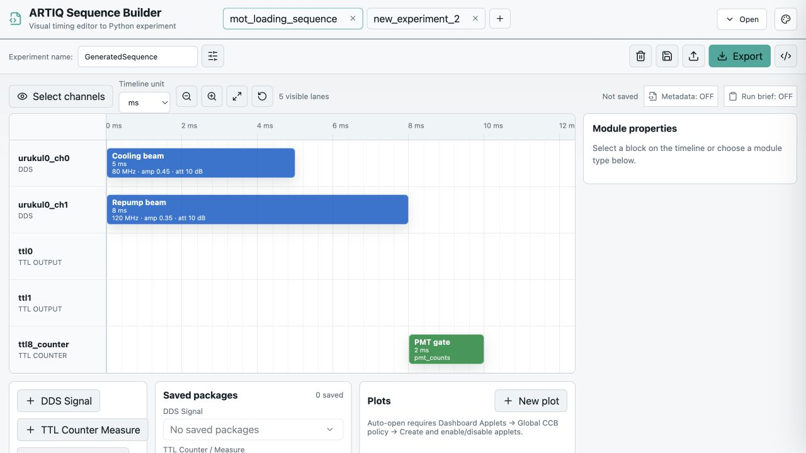

# ARTIQ Sequence Builder

A browser-based visual editor that turns laboratory timing sequences into readable ARTIQ `EnvExperiment` Python files.

This project was developed during a summer research project at HKU. Its central design rule is simple: **the visual timeline is the source of truth**. Hardware configuration describes the available channels, while Python code, measurement datasets, plots, and signal manifests are derived from the same sequence.



## What it does

- Edits multiple experiments in tabs using a channel-based timing diagram.
- Supports Urukul/AD9910 DDS, TTL output, TTL input, and TTL counter channels.
- Prevents overlaps on the same channel while allowing cross-channel parallel timing.
- Configures DDS frequency, amplitude, phase, phase mode, attenuation, and duration.
- Supports fixed values, linear sweeps, repetitions, and selected ARTIQ dashboard arguments.
- Generates ARTIQ Python continuously beside the timeline.
- Creates fixed-size datasets for counter results and optional Dashboard plots.
- Exports timeline diagrams, signal diagrams, Python, and parameter packages.
- Re-imports a generated Python file when Sequence Builder metadata was included, restoring the editable timeline and plot configuration.

## Quick start

Requirements: Node.js 18 or newer and npm.

```bash
git clone https://github.com/Davitao-005/expert-pancake.git
cd artiq-sequence-builder
npm install
npm run dev
```

Open the local URL printed by Vite, normally `http://localhost:5173/`.

To create a production build:

```bash
npm run build
```

The generated experiment imports ARTIQ APIs but the web editor itself does not require ARTIQ. Running exported Python on hardware requires a working ARTIQ installation and device names matching the laboratory's `device_db.py`.

## Typical workflow

1. Select the hardware channels used by the experiment.
2. Add DDS signals, TTL pulses, and counter gates to the timeline.
3. Edit timing and parameters in the module-properties panel.
4. Configure repetitions, inter-sequence delay, start slack, sweeps, arguments, and plots as needed.
5. Review the generated Python and signal manifest.
6. Turn **Metadata** on if the Python should remain importable by this editor.
7. Export the `.py` file and run it through the laboratory's normal ARTIQ workflow.

To continue editing an earlier export, click **Import Python**. Import is intentionally limited to files containing the delimited Sequence Builder metadata block; arbitrary Python is not reverse-engineered into a timeline.

## Feature guide

| Area | What the user can configure | Effect on generated output |
| --- | --- | --- |
| Channels | Show/hide configured Urukul DDS, TTL output/input, and TTL counter devices | Only channels used by tasks are requested in `build()` |
| Timeline | Drag tasks, edit start/duration/gap, choose `s`/`ms`/`us`, zoom, fit, and lock positions | Produces the channel-lane timing body; editor units are normalized to milliseconds in Python |
| DDS signal | Frequency, amplitude, phase, phase mode, attenuation, duration, and optional laser preset | Emits task-local AD9910 configuration and RF switch timing |
| TTL output | Start, duration, optional duration sweep, and optional duration argument | Emits `on()`, `delay()`, and `off()` in the TTL lane |
| Counter measurement | Gate duration, rising/falling/both edges, dataset name | Schedules a gate in its lane, then reads results in matching order |
| Run settings | Repetition, sequence gap, start slack, fetch batch | Chooses the outer loop/readout structure and RTIO recovery boundaries |
| Sweeps | Start, end, step, and points on DDS parameters or TTL duration | Generates scan values and scan/repetition loops; simultaneous sweeps use zipped point indices |
| Dashboard arguments | Selected numeric DDS values and TTL duration | Adds `NumberValue` arguments without changing channels or timeline topology |
| Plots | Enabled `plot_xy` definitions with compatible x/y datasets | Adds only required index/rate datasets and optional CCB applet launch requests |
| Packages | Save/reuse/export DDS, TTL pulse, and counter parameter presets | Affects editor input only; packages do not add hidden runtime state |
| Persistence | Save/open experiments and multiple working tabs in browser storage | Restores editor state locally; unsaved tabs are protected on close |
| Export | Python, timeline diagram, signal diagram, and package JSON | Creates handoff artifacts derived from the same timeline |
| Python import | Import a prior export containing Sequence Builder metadata | Restores modules, run settings, visible channels, and plots into an unsaved editor tab |

Important boundaries:

- TTL input channels may be listed in the channel selector, but the current module library creates TTL **counter** measurements rather than a general arbitrary TTL-input task.
- Position locking is an editor protection feature; it does not emit runtime Python.
- Timeline display units and UI tone are presentation choices; generated timing remains expressed consistently in ARTIQ units.
- The visual editor is the source of truth. Importing arbitrary handwritten Python and inferring an equivalent graph is outside the current scope.

## Generated-code formats

The generator chooses the smallest runtime structure that preserves the requested timing. Full reproducible files are in [`audit/generated`](audit/generated); the compact patterns below show the important forms.

### Scheduling contract: timeline → Python

This is the central formatting rule of the project. The generator does **not** translate every visual block into an independent absolute-time fragment. It first groups the complete timeline by physical channel and then renders each channel as one time-ordered lane.

| Timeline concept | Generated Python rule |
| --- | --- |
| Physical channel | One lane containing every task on that channel |
| Tasks on one channel | Sorted by `startMs` and executed serially |
| Two or more used channels | One outer `with parallel:` containing all channel lanes |
| One channel lane inside a multi-channel sequence | `# Channel: <device>` followed by `with sequential:` |
| First task in a lane | Delay from the sequence origin to that task's start |
| Later task in the same lane | Delay only from the previous task's end to the next task's start |
| Different channel lanes | Each lane has its own time cursor starting at the same sequence origin |
| One used channel | The extra `parallel`/`sequential` wrappers and channel comment are omitted |
| No tasks | `pass` |

In other words, for multi-channel sequences the canonical shape is:

```python
with parallel:
    # Channel: channel_A
    with sequential:
        # all channel_A tasks and its internal gaps
        ...
    # Channel: channel_B
    with sequential:
        # all channel_B tasks and its internal gaps
        ...
```

This matters because ARTIQ advances a separate cursor inside each `sequential` branch. The outer `parallel` starts all channel cursors from the same RTIO time, while the delays within a lane reconstruct that channel's positions. A delay in one lane therefore does not postpone another channel.

#### Example: reconstructing absolute positions with lane-local delays

Suppose the visual timeline contains:

| Channel | Task | Start | Duration | End |
| --- | --- | ---: | ---: | ---: |
| `ttl0` | A | 0 ms | 1 ms | 1 ms |
| `ttl0` | B | 3 ms | 2 ms | 5 ms |
| `ttl1` | C | 1 ms | 1 ms | 2 ms |
| `urukul0_ch0` | D | 2 ms | 2 ms | 4 ms |

The resulting schedule body is:

```python
with parallel:
    # Channel: urukul0_ch0
    with sequential:
        delay(2.0 * ms)                  # origin → D
        self.urukul0_ch0.set_att(10.0 * dB)
        self.urukul0_ch0.set(
            80.0 * MHz,
            amplitude=0.5,
            phase=0.0 / 360.0,
            phase_mode=PHASE_MODE_ABSOLUTE,
        )
        self.urukul0_ch0.sw.on()
        delay(2.0 * ms)                  # D duration
        self.urukul0_ch0.sw.off()
    # Channel: ttl0
    with sequential:
        self.ttl0.on()                   # A starts at the origin
        delay(1.0 * ms)                  # A duration
        self.ttl0.off()
        delay(2.0 * ms)                  # A end (1 ms) → B start (3 ms)
        self.ttl0.on()
        delay(2.0 * ms)                  # B duration
        self.ttl0.off()
    # Channel: ttl1
    with sequential:
        delay(1.0 * ms)                  # origin → C
        self.ttl1.on()
        delay(1.0 * ms)                  # C duration
        self.ttl1.off()
```

The lane order is deterministic and matches the editor's hardware ordering: Urukul board/channel order first, then ordinary TTL channels, then TTL counters, with numeric ordering inside each group. It does not depend on task creation order or on the order in which channels were selected.

#### Fixed timing versus sweep timing

Fixed and sweep experiments use the same channel-lane structure, but they preserve gaps differently:

- In a fixed sequence, a later gap is calculated from absolute positions: `next.startMs - previous.endMs`.
- In a sweep sequence, a duration may change at runtime. The generator therefore uses the editor's stored `gapAfterPrevious` for later tasks instead of subtracting a swept duration from a fixed start time.
- The first task of every lane still uses its offset from the common sequence origin.
- Sweep-value assignments are calculated once per scan point, outside the per-point repetition loop.

This separation prevents a duration sweep from accidentally moving or overlapping the following task in generated code.

#### DDS settings belong to their task lane

DDS `set_att()` and `set()` calls are emitted immediately before the corresponding DDS pulse inside that channel's lane. They are not collected into a global pre-configuration block. This is necessary when one DDS channel contains several tasks with different settings: pre-setting every task before the timeline would leave only the last configuration active when the first pulse starts.

The only DDS operations performed globally are hardware initialization (`cpld.init()` and channel `init()`). Within a DDS lane:

- the first DDS task emits its required attenuation and waveform configuration;
- an unchanged attenuation can omit a repeated `set_att()`;
- a later `CONTINUOUS` task can omit a repeated `set()` only when frequency, amplitude, and phase sources are identical;
- `ABSOLUTE`, `TRACKING`, or any waveform change always emits a new `set()`.

Arguments and sweep expressions replace parameter values inside these same task-local calls; they do not change the scheduling structure.

#### Wrappers are emitted only when they express real structure

The generator deliberately removes no-op scaffolding:

- one channel is rendered directly, without a one-branch `with parallel`;
- one fixed sequence with no measurement has no repetition loop;
- a repeated sequence without counters has a simple `repetition_index` loop and no fetch batching;
- a sweep with one repetition per point has no inner repetition loop;
- zero sequence gap and zero start slack emit no zero-valued variables or delays;
- `self.core.wait_until_mu(now_mu())` remains the final executable statement of the top-level kernel so the host does not continue before scheduled RTIO events finish.

### Generated class anatomy

Generated files follow a stable host/kernel separation:

```python
from artiq.experiment import *


class ExampleSequence(EnvExperiment):
    def build(self):
        # Device binding and optional Dashboard NumberValue arguments.
        ...

    def prepare(self):
        # Pure host-side constants: scan points, repetitions, gaps,
        # start slack, and batch size when those values are needed.
        ...

    def setup_datasets(self):
        # Optional host-side fixed-size NumPy result arrays.
        ...

    def launch_applets(self):
        # Optional host-side CCB requests for valid enabled plots.
        ...

    def print_run_brief(self):
        # Optional human-readable summary; removable at export time.
        ...

    @kernel
    def run_kernel(self):
        self.core.reset()
        self.core.break_realtime()
        # Optional initial slack, hardware initialization, scheduling,
        # counter readout, and dataset mutation.
        ...
        self.core.wait_until_mu(now_mu())

    def run(self):
        # Host orchestration calls only the helpers that were generated.
        self.setup_datasets()
        self.print_run_brief()
        self.launch_applets()
        self.run_kernel()
```

Methods that have no work are omitted where possible. `build()` always requests `core`; it requests only the used hardware devices, required Urukul CPLDs, and `ccb` only when an applet must be launched. NumPy is imported only when a numeric dataset is initialized. AD9910 phase constants are imported only when DDS channels are used.

### Runtime-structure selection

The experiment shape, rather than a single universal template, determines the generated loops:

| Sweep | Counter | Repetitions / batch | Generated execution structure |
| --- | --- | --- | --- |
| No | No | 1 | Direct sequence body; no repetition or batching variables |
| No | No | > 1 | One `for repetition_index in range(self.repetition)` loop |
| No | Yes | 1 | Schedule one shot, fetch immediately, publish at index `0` |
| No | Yes | > 1, batch = 1 | Per-shot schedule → fetch → mutate, then `break_realtime()` before the next shot |
| No | Yes | All shots fit | Schedule all shots first, then fetch/publish in the same repetition order |
| No | Yes | Multiple batches | Phase A schedules a batch; Phase B fetches it into buffers; Phase C publishes all datasets in shot order |
| Yes | No | 1 repetition/point | `scan_index` loop only; no fetch batching |
| Yes | No | > 1 repetitions/point | Outer `scan_index`, inner `repetition_index`; no flattened total-shot variable |
| Yes | Yes | batch = 1 | Each scan/repetition shot is scheduled, fetched, and published immediately |
| Yes | Yes | All shots fit | Schedule the full scan, then fetch in the same nested order and publish averages/raw shots |
| Yes | Yes | Multiple batches | Flatten schedule order with `shot_index`; recover `scan_index` by integer division; fetch each batch before continuing |

`Fetch batch` exists only to bound deferred counter readout. It is never generated for experiments without counters. A batch-boundary `break_realtime()` restores RTIO scheduling slack; it is not a physical sequence gap. Physical separation between experiments comes only from `Sequence gap`.

For repeated sweeps, the canonical mapping is:

```python
shot_index = scan_index * self.repetition_num_per_point + repetition_index
scan_index = shot_index // self.repetition_num_per_point  # flattened batching path
```

The generator intentionally avoids an unused `repetition_index = shot_index % ...` assignment during scheduling when the repeated parameter value depends only on `scan_index`.

### 1. One fixed TTL pulse

No unnecessary outer loop is emitted when the sequence runs once.

```python
@kernel
def run_kernel(self):
    self.core.reset()
    self.core.break_realtime()
    self.ttl0.on()
    delay(1.0 * ms)
    self.ttl0.off()
    self.core.wait_until_mu(now_mu())
```

See [`e01_core.py`](audit/generated/e01_core.py).

### 2. Serial tasks on one channel

Tasks are ordered by start time. Delays represent real gaps between neighbouring tasks, rather than absolute timestamps repeated throughout the file. Same-channel overlap is rejected by validation rather than being silently flattened.

```python
self.ttl0.on()
delay(1.0 * ms)
self.ttl0.off()
delay(1.0 * ms)
self.ttl0.on()
delay(0.5 * ms)
self.ttl0.off()
```

See [`e02_core.py`](audit/generated/e02_core.py).

### 3. Parallel tasks on different channels

Each physical channel becomes a `sequential` lane inside one `parallel` block. This mirrors the visual timeline and keeps delays local to each channel. All tasks from the same channel stay in the same lane; the generator does not create one parallel branch per task.

```python
with parallel:
    # Channel: ttl0
    with sequential:
        self.ttl0.on()
        delay(3.0 * ms)
        self.ttl0.off()
    # Channel: ttl1
    with sequential:
        delay(1.0 * ms)
        self.ttl1.on()
        delay(1.0 * ms)
        self.ttl1.off()
```

See [`e03_core.py`](audit/generated/e03_core.py) and the mixed DDS/TTL example [`e05_core.py`](audit/generated/e05_core.py).

### 4. DDS pulse

DDS hardware is initialized explicitly. Frequency, amplitude, phase, phase mode, and attenuation are applied before switching RF on.

```python
self.urukul0_cpld.init()
self.urukul0_ch0.init()
self.urukul0_ch0.set_att(10.0 * dB)
self.urukul0_ch0.set(
    80.0 * MHz,
    amplitude=0.5,
    phase=0.0 / 360.0,
    phase_mode=PHASE_MODE_ABSOLUTE,
)
self.urukul0_ch0.sw.on()
delay(2.0 * ms)
self.urukul0_ch0.sw.off()
```

See [`e04_core.py`](audit/generated/e04_core.py).

For consecutive tasks on the same DDS channel, `CONTINUOUS` can reuse an unchanged frequency/amplitude/phase configuration across an RF-off gap. A changed waveform, `ABSOLUTE`, or `TRACKING` causes a new `set()` call. Attenuation is compared independently.

DDS phase is entered in degrees in the editor and converted to turns for AD9910 `set()`. `ABSOLUTE` is the default and establishes the requested phase when `set()` is applied, not at a later `sw.on()` edge. `CONTINUOUS` preserves the existing accumulator and is appropriate only when continuity across an RF-off gap is intended. `TRACKING` emits the corresponding tracking mode but experiments requiring a precise external phase reference may still need laboratory-specific timing compensation.

### 5. Repetitions without a sweep

Fixed sequences use `self.repetition`. Counter experiments fetch in configurable batches so a long acquisition does not leave all results queued until the end.

```python
for batch_start in range(0, self.repetition, self.sequence_batch_size):
    batch_end = min(batch_start + self.sequence_batch_size, self.repetition)
    for shot_index in range(batch_start, batch_end):
        # run the sequence and gate counters
        pass
    self.core.break_realtime()
    # fetch and publish this batch
```

Without a counter, the generator uses a direct repetition loop and omits batching state.

### 6. TTL counter measurements

Counter gates execute in the kernel and results are published into host-created, fixed-size NumPy datasets.

```python
# Host-side setup
self.set_dataset(
    "measurement.ttl8_counter.counts",
    np.full(self.repetition, -1, dtype=np.int32),
    broadcast=True,
    archive=True,
)

# Kernel-side measurement lane and deferred readout
self.ttl8_counter.gate_rising(2.0 * ms)
pmt_counts = self.ttl8_counter.fetch_count()
self.mutate_dataset(
    "measurement.ttl8_counter.counts", shot_index, pmt_counts
)
```

The gate is part of the counter channel's timing lane. `fetch_count()` is kept in schedule order after the relevant gate scheduling phase. Multiple counters keep separate result buffers and datasets.

### 7. Sweeps

The experiment has one shared scan index, but several DDS parameters and/or TTL durations may be swept together. All enabled sweeps must contain the same number of points, so they use zipped rather than Cartesian-product semantics. The scan loop is outside the per-point repetition loop.

```python
for scan_index in range(self.scan_points):
    scan_value_frequency = 78.0 + 0.5 * scan_index
    scan_value_amplitude = 0.2 + 0.05 * scan_index
    for repetition_index in range(self.repetition_num_per_point):
        # use both values in the same scan point
        pass
```

The editor keeps `start`, `end`, `step`, and `points` mutually consistent and blocks export when sweep definitions are invalid or enabled sweeps have different point counts. Positive and negative linear steps are supported. A duration sweep changes the task's runtime delay; downstream tasks retain the explicitly stored gap after the swept task.

Sweep plus counter output uses:

- `measurement.<counter>.average_counts`, shape `(scan_points,)`;
- `measurement.<counter>.raw_counts`, shape `(scan_points * repetitions,)`, when repetitions per point are greater than one;
- `shot_index = scan_index * repetitions + repetition_index` for the flattened raw array.

Sweep metadata stays in the optional run brief and embedded builder metadata instead of filling the ARTIQ dataset table with descriptive values.

### 8. Dashboard arguments

Selected numeric values can be exposed without making the experiment structure mutable.

```python
def build(self):
    self.setattr_argument(
        "repump_amplitude",
        NumberValue(default=0.35, min=0.0, max=1.0),
    )

# Later in the kernel
self.urukul0_ch1.set(120.0 * MHz, amplitude=self.repump_amplitude)
```

Supported arguments are DDS frequency, amplitude, phase, duration, attenuation, and TTL-output duration. A swept parameter cannot simultaneously be an argument. Channel selection, task existence, enable state, and timing structure remain fixed by the timeline.

### 9. Plot-enabled experiments

Plots are optional and drive only the extra datasets they require. For example, a scan-average plot requests `scan_index`; a raw-shot plot requests `shot_index`; count-rate arrays are created only for count-rate plots.

```python
def launch_applets(self):
    self.ccb.issue(
        "create_applet",
        "PMT counts",
        "${artiq_applet}plot_xy measurement.ttl8_counter.average_counts "
        "--x scan_index",
        group="Sequence Builder",
    )
```

Automatic opening requires one Dashboard setting: **Applets → Global CCB policy → Create and enable/disable applets**.

### 10. Importable Python

When **Metadata** is enabled, the export contains commented JSON between stable markers:

```python
# --- SEQUENCE_BUILDER_METADATA_START ---
# {
#   "schemaVersion": 1,
#   "format": "ARTIQ Sequence Builder",
#   "editorState": { ... },
#   "plots": [ ... ]
# }
# --- SEQUENCE_BUILDER_METADATA_END ---
```

ARTIQ ignores the comments. The web UI validates this block and reconstructs the experiment. **Run brief** is independent: it adds concise human-readable runtime output and is not required for import.

## Result dataset rules

| Experiment | Always generated | Plot-driven additions |
| --- | --- | --- |
| Fixed, counter | `measurement.<counter>.counts` | `shot_index`, `count_rate` |
| Sweep, one repetition | `measurement.<counter>.average_counts` | `scan_index`, `average_count_rate` |
| Sweep, repeated | `average_counts` and flattened `raw_counts` | `scan_index`, `shot_index`, average/raw count rate |
| No counter | No measurement dataset | Only datasets required by a valid enabled plot |

Disabled or invalid plot definitions do not alter the generated experiment.

## Validation and audit

```bash
npm run test:generator
npm run test:packages
npm run test:package-ui
npm run audit:generate
npm run build
```

The audit directory contains metadata-on user exports and metadata/run-brief-off core exports, making generated-code complexity easy to compare. See [`audit/README.md`](audit/README.md) and [`audit/E01-E05-review.md`](audit/E01-E05-review.md).

The generator and UI have automated/static validation, but the repository does **not** claim universal hardware validation. Before laboratory use, check device names, installed ARTIQ version, RTIO slack, Urukul initialization policy, electrical routing, and observed timing on the target system.

## Project structure

```text
src/App.tsx                    main visual editor
src/pythonGenerator.ts        ARTIQ Python generation
src/pythonMetadataImport.ts   generated-Python metadata parser
src/validation.ts             timeline validation
src/plotDatasets.ts           dataset/plot compatibility rules
src/experimentStorage.ts      saved experiment normalization
scripts/                      regression and audit scripts
audit/                        generated examples and review notes
```

## Scope and future work

This version is a sequence authoring and code-generation tool, not a replacement for the ARTIQ Dashboard or a general Python-to-diagram decompiler. Possible future work includes laboratory-specific channel configuration import, richer static analysis of arbitrary ARTIQ files, and hardware-in-the-loop timing tests.

## Acknowledgements

This repository marks the completion of my summer research project at HKU. Thank you to the teachers and researchers who discussed experimental requirements, challenged edge cases, and helped turn the initial idea into a working visual-to-ARTIQ workflow.
